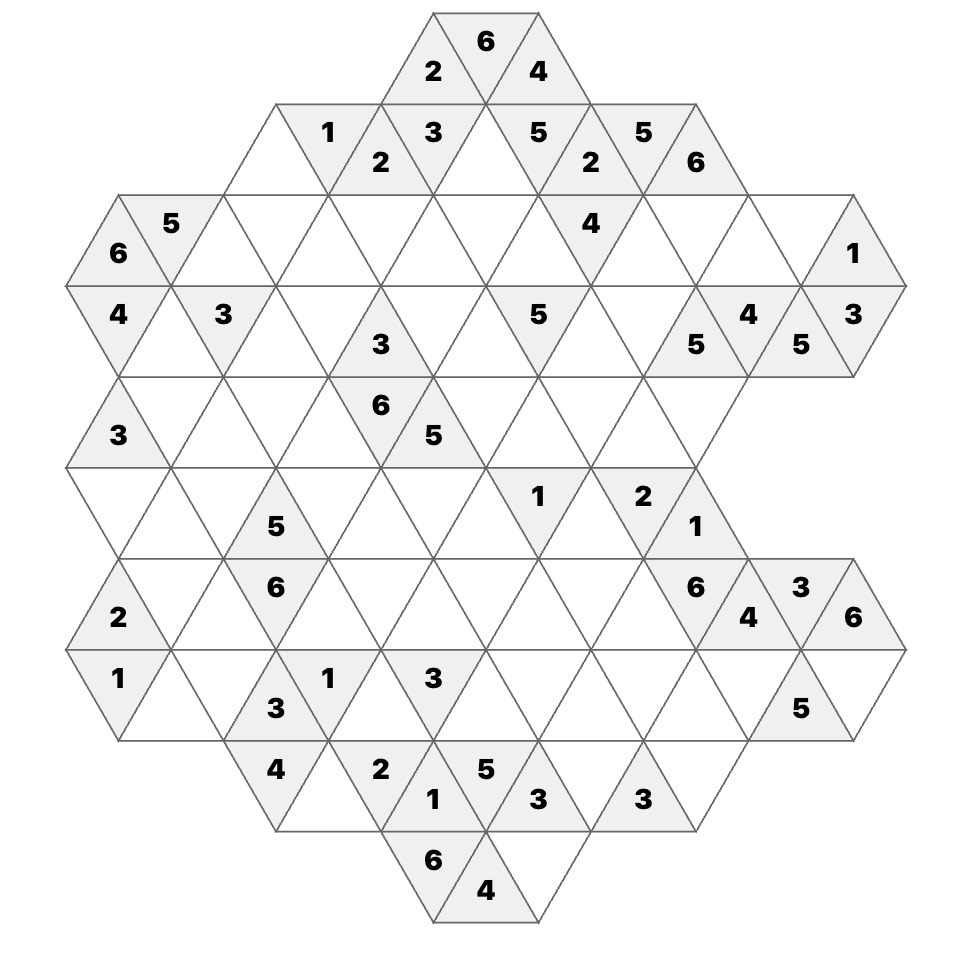

# Snowflake Sudoku

A parametric hexagonal sudoku puzzle generator with an interactive static web interface. Generate valid puzzles at any scale — from single hexagons to complex multi-ring topologies — and solve them in a beautiful, minimalist web app.

**Play online:** https://www.marksantolucito.com/snowflakesudoku/

## What is Snowflake Sudoku?

Snowflake sudoku is a hexagonal variant where:
- Each puzzle is made of **hexagons** arranged in a snowflake pattern
- Each hexagon contains **6 triangular cells**
- Cells must contain digits **1–6** with each hexagon containing exactly one of each digit (like Sudoku)
- **Meeting points** (vertices where 6 cells converge) form additional constraints

The geometry is built parametrically using **axial coordinates** (q, r) on an infinite hexagonal grid. This means we can generate valid puzzles of any complexity without manual coordination.



## Quick Start

### 1. Start the Static Site

The puzzle interface is a self-contained HTML file. No server setup needed:

```bash
python3 -m http.server 8080
```

Then open **http://localhost:8080** in your browser. You'll see an interactive hexagonal grid with puzzles loaded from `static/puzzles.json`.

### 2. Solve a Puzzle

- **Click a cell** to select it (or use direct link: `?puzzle=CODE`)
- **Use keyboard** (1–6) or click digit buttons to fill the cell
- **Clear cells** with 0, Backspace, or Delete
- **Watch real-time validation** — the status panel shows:
  - **Topology**: current puzzle's size (n value + constraint count)
  - **Givens**: pre-filled cells
  - **Cells**: total/filled/empty
- **Errors appear in red** — violated constraints highlight automatically
- **Solve it!** — press "New Puzzle" for a random puzzle, "Show Solution" to reveal the answer
- **Share puzzles** — your selected puzzle appears in the URL for easy sharing

## File Structure

```
snowflake-sudoku/
├── README.md                          # This file
├── pyproject.toml                     # Project metadata (Python ≥3.10)
├── index.html                         # Interactive web puzzle solver (root level)
├── snowflake/
│   ├── __init__.py                    # Package marker
│   └── parametric_topology.py         # Topology engine (the core library)
├── scripts/
│   ├── generate_with_parametric.py    # Generate puzzles via CVC5
│   └── export_static.py               # Export to static/puzzles.json
├── static/
│   └── puzzles.json                   # Puzzle dataset (loaded by browser)
├── puzzles_source.json                # Source puzzle data (for regeneration)
└── tests/
    ├── __init__.py
    └── test_topology.py               # Topology sanity tests
```

## Generating Puzzles

To generate new puzzles, you need **CVC5** (a constraint solver). Install it:

```bash
# macOS
brew install cvc5

# Ubuntu/Debian
apt-get install cvc5

# Or download from: https://cvc5.github.io/
```

Then generate puzzles:

```bash
python scripts/generate_with_parametric.py \
  --n 4 \
  --count 5 \
  --output puzzles_new.json \
  --cvc5 /path/to/cvc5    # Optional; omit if cvc5 is on PATH
```

This generates 5 puzzles with n=4 topology (4 hexagons, 24 cells, 6 constraints).

### Export to Static JSON

After generating puzzles, export them with embedded topology data so the frontend can render them:

```bash
python scripts/export_static.py \
  --input puzzles_new.json \
  --output static/puzzles.json
```

Refresh the browser — it'll load your new puzzles.

## Topology Scaling

The system supports **any n value** (number of hexagons). Current dataset includes:

| n | Hexagons | Cells | Constraints | Puzzles | Complexity |
|---|----------|-------|-------------|---------|-----------|
| 4 | 4 | 24 | 6 | 12 | Easy |
| 5 | 5 | 30 | 8 | 12 | Easy–Medium |
| 7 | 7 | 42 | 13 | 12 | Medium |
| 10 | 10 | 60 | 19 | 12 | Medium–Hard |
| 13 | 13 | 78 | 27 | 12 | Hard (ring 2 complete) |
| 19 | 19 | 114 | 43 | 12 | Very hard |
| ∞ | ∞ | ∞ | ∞ | ∞ | Unlimited |

**Dataset summary**: 192 puzzles total (12 per topology size, n=4 to n=19)

Topologies are generated automatically using a **hexagonal ring algorithm**:
- Ring 0: center (0, 0)
- Ring k: 6k hexagons in a hexagonal ring around the center
- Ring 1 completes at n=7 (1 + 6 = 7 total)
- Ring 2 completes at n=13 (1 + 6 + 6 = 13)

No manual coordination needed — just pick an n value and the system generates valid constraints geometrically.

## How It Works

### 1. Topology Engine (`snowflake/parametric_topology.py`)

Builds constraint groups for any n value:

```python
from snowflake.parametric_topology import build_snowflake, HEX_COORDS_BY_N

# Get topology for n=4
constraints, n_cells = build_snowflake(4)
# Returns: 24 cells, 6 constraints (4 hexagons + 1 meeting point)

# Get hex coordinates for each hexagon
hex_coords = HEX_COORDS_BY_N[4]  # [(0,0), (1,-1), (-1,0), (0,-1)]
```

Each constraint is a list of cell indices that must contain distinct digits 1–6. Meeting points are detected geometrically by finding vertices where exactly 6 cells converge.

### 2. Puzzle Generation (`scripts/generate_with_parametric.py`)

Uses **CVC5** (an SMT solver) to generate valid solutions with **guaranteed uniqueness**:

1. Build topology with `build_snowflake(n)`
2. Generate SMT-LIB model encoding all constraints
3. Call CVC5 to find a satisfying assignment (the solution)
4. **Iterative progressive removal**: 
   - Start with all cells as givens
   - Try removing each cell in shuffled order
   - For each cell, check if the puzzle remains uniquely solvable (using a blocking clause SMT query)
   - Keep the cell removed if unique, restore it if removing breaks uniqueness
   - Stop once no more cells can be removed without breaking uniqueness (minimal puzzle)
5. Create harder variants by progressively adding back removed cells

This guarantees each puzzle has exactly one valid solution. The algorithm uses ~O(n_cells) CVC5 calls per puzzle.

```bash
python scripts/generate_with_parametric.py --n 7 --count 10 --output puzzles.json
```

Puzzle codes use the format `CODE-SIZE-GIVENS` (e.g., `VGF-4-13`):
- **CODE**: 3-letter alphanumeric puzzle ID
- **SIZE**: topology parameter n
- **GIVENS**: number of pre-filled cells

When multiple difficulty variants exist with the same givens, they get suffixes: `VGF-4-15a`, `VGF-4-15b`, etc.

### 3. Static Export (`scripts/export_static.py`)

Embeds topology data into puzzle JSON so the frontend can render without a backend:

```json
{
  "id": 0,
  "n": 4,
  "puzzle": [1, 2, 7, 7, ...],
  "solution": [1, 2, 3, 4, ...],
  "givens": 15,
  "topology": {
    "n_cells": 24,
    "hex_coords": [{"q": 0, "r": 0}, ...],
    "cell_positions": [{"q": 0, "r": 0, "direction": "NE"}, ...],
    "constraints": [[0, 1, 2, 3, 4, 5], ...]
  }
}
```

### 4. Web Frontend (`static/index.html`)

Pure HTML + CSS + JavaScript (no dependencies):
- **SVG rendering** — hexagons are 6 triangles per hexagon, drawn from axial coordinates
- **Client-side validation** — checks constraints in JavaScript, no server needed
- **Responsive design** — scales to mobile with CSS Grid

The hexagon math:

```javascript
// Axial to Cartesian
x = HEX_SIZE * (3/2 * q)
y = HEX_SIZE * (sqrt(3)/2 * q + sqrt(3) * r)

// Each hexagon has 6 triangular cells (directions: NE, E, SE, SW, W, NW)
// Cell positions are stored in the puzzle topology
```

## Running Tests

```bash
python -m pytest tests/ -v
```

Tests verify:
- Ring generation produces correct hexagon counts
- Constraint counts match expectations
- Cell positions are valid
- Meeting points are detected correctly

## Extending the System

### Add a New Topology Size

Ring generation is automatic. Just use any n value:

```bash
python scripts/generate_with_parametric.py --n 100 --count 1 --output huge.json
```

### Change Puzzle Difficulty

The `--variants` flag controls how many difficulty levels are generated from each base puzzle:

```bash
python scripts/generate_with_parametric.py --n 7 --count 5 --variants 4
```

This generates 5 base puzzles with 4 variants each (minimal + 3 progressively easier versions).

The minimal puzzle has the absolute fewest givens where the solution is still unique. Variants add back removed cells to create easier versions, all guaranteed unique.

### Customize the Frontend

Edit `static/index.html`:
- **Colors**: CSS variables at the top (`:root { --primary: ... }`)
- **Hexagon size**: `const HEX_SIZE = 90` (pixels)
- **Validation logic**: `validate()` function (pure JS, no server calls)

## Browser Support

- Chrome/Edge 90+
- Firefox 88+
- Safari 14+
- Responsive design works on tablets

## Performance

- **Frontend**: 60 FPS interactions, <100ms validation
- **Generation**: ~1–5 seconds per puzzle (CVC5 solving time)
- **Export**: <1 second for 100 puzzles
- **Static site**: <50 KB (index.html + one puzzle dataset)

## Architecture

```
User clicks on puzzle (static/index.html)
    ↓
JavaScript loads static/puzzles.json
    ↓
SVG renders hexagons from cell_positions
    ↓
User fills cells
    ↓
JavaScript validates constraints (pure JS)
    ↓
Status updates in real-time
```

**No server. No API calls. No dependencies.** Just HTML, CSS, and JavaScript talking to a static JSON file.

## References

- **Hexagonal grids**: https://www.redblobgames.com/grids/hexagons/ (the definitive guide)
- **CVC5**: https://cvc5.github.io/ (SMT solver, used for puzzle generation)
- **Axial coordinates**: https://www.redblobgames.com/grids/hexagons/#coordinates (q, r system we use)

## License

MIT (or match parent project if part of a larger system).

## Features Implemented

- ✓ Guaranteed unique solutions (iterative progressive removal with CVC5)
- ✓ Parametric topology (any n value, no hardcoded limits)
- ✓ Minimal puzzle generation with difficulty variants
- ✓ Keyboard input (1–6, 0, Backspace, Delete)
- ✓ URL parameter sharing (?puzzle=CODE)
- ✓ Real-time constraint validation
- ✓ Static site (no backend, no dependencies)

## Future Ideas

- Difficulty ratings (easy/medium/hard based on solution search depth)
- Leaderboard & timing
- Hint system (constraint propagation suggestions)
- Dark mode toggle
- Undo/redo with history
- Export as image or PDF
- Multiplayer mode
